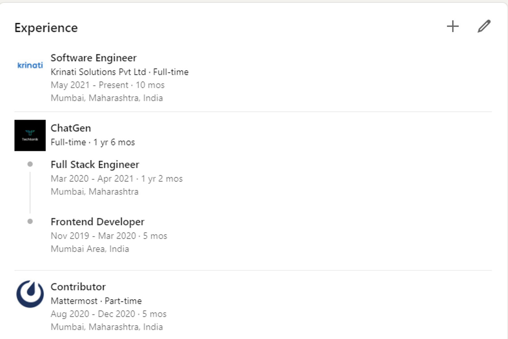

# Frontend Development Intern - Round 1


Develop a Simple Angular Timeline Component Describing your Education

### Objective:

-   Candidate’s ability to pick up a new technology or framework

### Requirements:

-   You need to learn very basic `Angular` in order to submit the given assignment

### Demo Design:



Credit: [linkedin.com](http://linkedin.com)

> It is not compulsory to develop exact same design, feel free to improvise

### Deliverables

1. Create an [Angular](https://angular.io/start) project
2. Create single home component
3. Create a Timeline component which fetches job timeline data as input - whatever structure you can use for jobs.

    1. e.g.

    ```jsx
    jobs = [
      {
        company: "ChatGen",
        startDate: "Mar 2020"
        endDate: "Apr 2021",
        title: "Frontend Developer"
      },
      {
        company: "Mattermost",
        startDate: "Aug 2020",
        endDate: "Dec 2020",
        title: "Contributor"
      }
    ]
    # above can be input to timeline component from parent component
    ```

4. render timeline component from home component

### Technology:

1. You can use `Angular` to build this frontend
2. Extra point for any other improvisations in UI / UX

### How to submit?

1. Just push the code to `public` version control systems like GitHub, GitLab, etc., and submit the repo link in the `Indeed` chat
